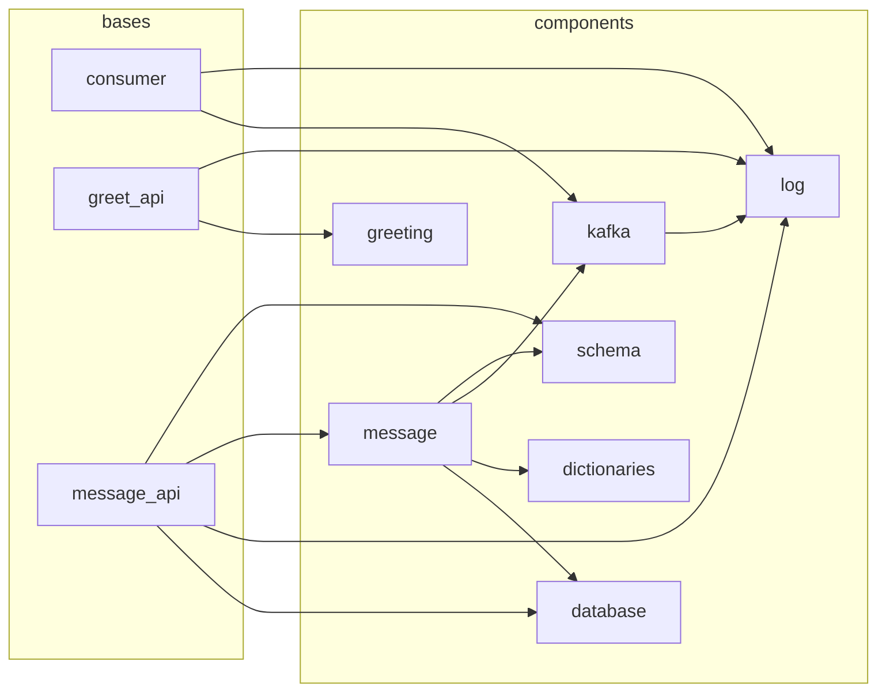

# polydep

Dependency graph and boundary enforcement for Python Polylith workspaces.

`polydep` analyzes inter-brick imports in a [Python Polylith](https://github.com/DavidVujic/python-polylith) monorepo and outputs a Mermaid dependency graph. It complements the `poly` CLI by adding graph visualization, dependency chain explanation, and CI-friendly boundary checks.

Read-only — never modifies workspace files.

## Install

```bash
pip install polydep
# or
uv tool install polydep
```

Requires Python 3.11+.

## Quick start

```bash
# Generate a dependency graph as Mermaid
polydep graph

# Specify a workspace root
polydep graph --root /path/to/workspace

# Save to polydep.expected.mermaid
polydep graph --save
```

Example output:



## Commands

### `polydep graph`

Print the dependency graph as a Mermaid diagram to stdout.

```bash
polydep graph [--root <path>] [--save]
```

| Flag | Default | Description |
|------|---------|-------------|
| `--root <path>` | `.` | Workspace root directory |
| `--save` | | Write to `polydep.expected.mermaid` instead of printing |

### `polydep why`

Explain why brick A depends on brick B — shows all dependency paths with exact file and line provenance.

```bash
polydep why <source_brick> <target_brick> [--root <path>]
```

Example output:

```
consumer depends on log via 2 paths:

Path 1 (direct):
  consumer -> log
    bases/example/consumer/core.py:3  from example import kafka, log

Path 2 (transitive, length 2):
  consumer -> kafka -> log
    bases/example/consumer/core.py:3  from example import kafka, log
    components/example/kafka/consumer.py:5  from example import log
    components/example/kafka/producer.py:3  from example import log
```

### `polydep check`

Compare actual dependencies against an expected graph file. Designed for CI — exits non-zero on mismatch.

```bash
polydep check [--expected <path>] [--root <path>]
```

| Flag | Default | Description |
|------|---------|-------------|
| `--expected <path>` | `polydep.expected.mermaid` | Path to expected graph file |
| `--root <path>` | `.` | Workspace root directory |

The expected graph file is a Mermaid file, typically generated by `polydep graph --save`. Strict comparison — unexpected edges (boundary violations) and missing edges (stale graph) cause failure. Unexpected edges include file and line provenance.

When the graph matches:

```
Check passed.
```

When there are violations:

```
Check failed.

Unexpected dependencies:
  consumer --> database
    bases/example/consumer/core.py:3  from example import database, kafka, log

Missing dependencies:
  greet_api --> log
```

| Exit code | Meaning |
|-----------|---------|
| 0 | Actual graph matches expected graph |
| 1 | Mismatch detected |
| 2 | Error (file not found, parse error, etc.) |

## CI integration

### Bootstrap an expected graph

```bash
polydep graph --save
git add polydep.expected.mermaid && git commit -m "Add expected dependency graph"
```

### GitHub Actions

```yaml
- uses: astral-sh/setup-uv@v5
- run: uv tool install polydep
- run: polydep check
```

### Pre-commit hook

```yaml
# .pre-commit-config.yaml
- repo: local
  hooks:
    - id: polydep-check
      name: polydep boundary check
      entry: uv run polydep check
      language: system
      pass_filenames: false
```

## How it works

1. **Workspace discovery** — finds `workspace.toml` (or `pyproject.toml` with `[tool.polylith]`) and reads the namespace
2. **Brick enumeration** — scans `components/<namespace>/*/` and `bases/<namespace>/*/`
3. **Import extraction** — parses every `.py` file with Python's `ast` module, collecting all absolute imports (relative imports are skipped as they're internal to a brick)
4. **Graph construction** — filters imports to those targeting known bricks (matching `<namespace>.<brick_name>`), excludes self-imports, and builds a deduplicated edge set
5. **Output** — renders the graph as a Mermaid diagram with subgraph grouping by brick type

## Comparison with `poly` CLI

| Feature | `poly` CLI | `polydep` |
|---------|-----------|-----------|
| Dependency table | `poly deps` | -- |
| Dependency graph (Mermaid) | -- | `polydep graph` |
| Dependency explanation | -- | `polydep why` |
| Boundary enforcement | -- | `polydep check` |
| Missing deps in project | `poly check` | -- |
| Library analysis | `poly libs` | -- |

`polydep` complements rather than replaces `poly`. It focuses on the inter-brick dependency graph.