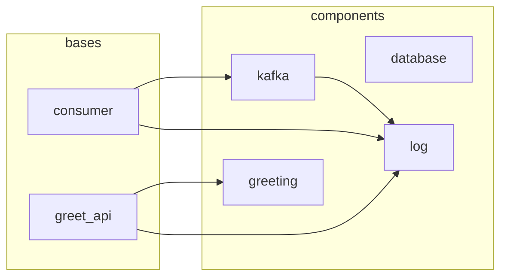

# polydep

Dependency graph and boundary enforcement for Python Polylith workspaces.

`polydep` analyzes inter-brick imports in a [Polylith](https://polylith.gitbook.io/polylith) monorepo and outputs a Mermaid dependency graph. It complements the `poly` CLI by adding graph visualization, dependency chain explanation, and CI-friendly boundary checks.

Read-only — never modifies workspace files.

## Install

```bash
pip install polydep
# or
uv tool install polydep
```

Requires Python 3.11+.

## Quick start

```bash
# Generate a dependency graph as Mermaid
polydep graph

# Specify a workspace root
polydep graph --root /path/to/workspace
```

Example output:



## Commands

### `polydep graph`

Print the dependency graph as a Mermaid diagram to stdout.

```bash
polydep graph [--root <path>]
```

| Flag | Default | Description |
|------|---------|-------------|
| `--root <path>` | `.` | Workspace root directory |

Pipe to a file to save: `polydep graph > deps.mermaid`

### `polydep why` (planned)

Explain why brick A depends on brick B — shows all dependency paths with exact file and line provenance.

### `polydep check` (planned)

Compare actual dependencies against an expected graph file. Designed for CI — exits non-zero on mismatch (unexpected or missing edges).

## How it works

1. **Workspace discovery** — finds `workspace.toml` (or `pyproject.toml` with `[tool.polylith]`) and reads the namespace
2. **Brick enumeration** — scans `components/<namespace>/*/` and `bases/<namespace>/*/`
3. **Import extraction** — parses every `.py` file with Python's `ast` module, collecting all absolute imports (relative imports are skipped as they're internal to a brick)
4. **Graph construction** — filters imports to those targeting known bricks (matching `<namespace>.<brick_name>`), excludes self-imports, and builds a deduplicated edge set
5. **Output** — renders the graph as a Mermaid diagram with subgraph grouping by brick type

## Project structure

```
src/polydep/
  cli.py             # Click CLI
  workspace.py       # Config parsing and brick/file scanning
  import_parser.py   # AST-based import extraction
  graph.py           # Dependency graph construction
  mermaid.py         # Mermaid diagram generation
  models.py          # Frozen dataclasses: Workspace, Brick, Import, Edge, DependencyGraph
```

## Development

### Setup

```bash
git clone https://github.com/aulme/polydep.git
cd polydep
uv sync
```

### Common commands

```bash
uv run pytest              # Run tests
uv run ruff check .        # Lint
uv run ruff format .       # Format
uv run ty check src/ tests/  # Type check
uv run polydep graph --root sample_project  # Smoke test
```

### CI

GitHub Actions runs three parallel jobs on every push and PR:

- **test** — `pytest`
- **lint** — `ruff check` + `ruff format --check`
- **typecheck** — `ty check`

### Architecture notes

- All data structures are **frozen dataclasses** with tuples (immutable by design)
- `import_parser.py` is a pure function: source string in, imports out — no filesystem access
- `workspace.py` handles all filesystem concerns and returns a fully populated `Workspace`
- `graph.py` takes a `Workspace` and returns a `DependencyGraph` — no I/O
- The only runtime dependency is `click`

### Test strategy

Tests use two approaches:

- **Unit tests** construct `Workspace`/`DependencyGraph` objects directly in memory — fast, no filesystem
- **Integration tests** use a `sample_project/` fixture (a real Polylith workspace with 10 bricks and known dependencies)

### Dependencies

| Dependency | Purpose |
|------------|---------|
| `click` | CLI framework |
| `ast` (stdlib) | Import extraction |
| `tomllib` (stdlib) | Config parsing |

Dev tools: `uv`, `pytest`, `ruff`, `ty`
