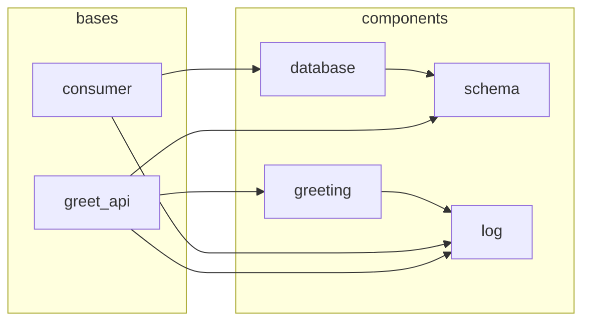
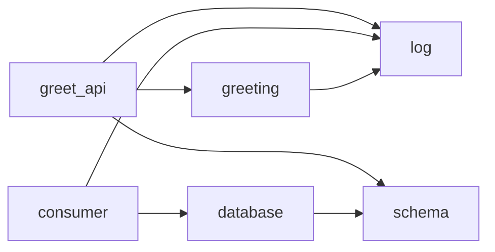

# polydep — Dependency Graph & Boundary Enforcement for Python Polylith

## Overview

`polydep` is a standalone Python CLI that analyzes Python Polylith workspaces to produce dependency graphs, explain dependency chains, and enforce architectural boundaries between bricks.

It fills gaps in `python-polylith` (`poly` CLI) which provides terminal-based dependency tables (`poly deps`) and missing-dependency checks (`poly check`) but lacks:

- **Graph/diagram output** (Mermaid)
- **Transitive dependency chain explanation** ("why does A depend on B?")
- **Boundary enforcement** against an expected dependency graph (fail CI when unexpected cross-brick imports appear)

`polydep` is read-only — it never modifies workspace files.

---

## Terminology

| Term | Meaning |
|---|---|
| **Workspace** | The monorepo root containing `workspace.toml` |
| **Brick** | A namespace package under `components/` or `bases/` |
| **Component** | A brick under `components/` — reusable internal code |
| **Base** | A brick under `bases/` — external-facing entry point |
| **Project** | A deployable artifact under `projects/` |
| **Namespace** | The top-level Python package name (from `workspace.toml` → `[tool.polylith].namespace`) |
| **Direct dependency** | Brick A imports brick B |
| **Transitive dependency** | Brick A depends on B through one or more intermediate bricks |

---

## Workspace Discovery

### Locating the workspace root

1. Walk up from CWD (or `--root <path>`) looking for `workspace.toml`.
2. Parse `workspace.toml` to extract:
   - `namespace` — the top-level Python package name (e.g., `example`)
   - `theme` — `"loose"` (default for Python) or `"tdd"` (components have their own `test/` dirs)
3. Also support the alternative config location: `[tool.polylith]` section inside root `pyproject.toml` (some workspaces use this instead of `workspace.toml`).

### Enumerating bricks

Discover bricks by scanning the filesystem:

- `components/<namespace>/*/` — each subdirectory is a component brick
- `bases/<namespace>/*/` — each subdirectory is a base brick

The brick's **name** is the subdirectory name. Its **qualified import path** is `<namespace>.<name>`.

---

## Import Analysis

### How to extract Python imports

For each brick, recursively find all `*.py` files and extract imports using the `ast` module from the Python standard library.

Parse each `.py` file into an AST using `ast.parse()`. Walk the tree and extract:

- `ast.Import` nodes — `import <module>` statements
- `ast.ImportFrom` nodes — `from <module> import ...` statements
- Only absolute imports (ignore relative imports where `node.level > 0`)
- **Exclude** imports inside `if TYPE_CHECKING:` blocks (these are type-only and do not create runtime dependencies)

For each extracted import, record:
- The module path (e.g., `example.greeting`)
- The source file path (relative to workspace root)
- The line number (`node.lineno`)
- The raw import statement (reconstructed from the AST node)

### Filtering imports to brick dependencies

From all collected imports, keep only those that:

1. Start with the workspace namespace (e.g., `example.`)
2. Have a second segment that matches a known brick name

Example: `from example.greeting import hello` → dependency on brick `greeting`.

Discard: stdlib imports, third-party imports, self-imports (brick importing itself).

### Building the dependency graph

Produce a directed graph where:

- **Nodes** = bricks (with metadata: type `component` | `base`, path)
- **Edges** = brick A imports brick B (with metadata: list of source files and line numbers where the import occurs)

Store edges with full provenance: `{from_brick, to_brick, [{file, line, import_statement}]}`.

---

## Commands

### `polydep graph`

Generate a dependency graph of bricks in the workspace.

#### Usage

```
polydep graph [flags]
```

#### Flags

| Flag | Default | Description |
|---|---|---|
| `--root <path>` | CWD | Workspace root directory |
| `--project <name>` | (all) | Scope to bricks used by a specific project |
| `--brick <name>` | (all) | Show only the subgraph reachable from this brick (upstream + downstream) |

#### Output

Mermaid format to stdout. Pipe to a file to save (e.g., `polydep graph > polydep.expected.mermaid`).

The graph always includes:
- **Subgraph grouping** by brick type (`bases` vs `components`)
- **Transitive edges** shown as dashed lines (`-.->`) alongside direct edges (`-->`)
- **All reachable bricks** (full transitive closure when `--brick` is used)



---

### `polydep why <source> <target>`

Explain why brick `source` depends on brick `target`. Shows all dependency paths and the exact import locations.

#### Usage

```
polydep why <source_brick> <target_brick> [flags]
```

#### Flags

| Flag | Default | Description |
|---|---|---|
| `--root <path>` | CWD | Workspace root directory |

#### Behavior

1. Find all paths from `source` to `target` in the dependency graph (BFS/DFS with cycle detection).
2. For each path, resolve the import provenance (file + line number) for every edge.
3. If no path exists, exit with code 0 and print a message.
4. If `source` directly imports `target`, show the direct import locations.

#### Output

```
greet_api depends on schema via 2 paths:

Path 1 (direct):
  greet_api -> schema
    bases/example/greet_api/core.py:5  from example.schema import MessageSchema

Path 2 (transitive, length 2):
  greet_api -> greeting -> schema
    bases/example/greet_api/core.py:3  from example.greeting import hello
    components/example/greeting/core.py:1  from example.schema import MessageSchema
```

#### Exit codes

| Code | Meaning |
|---|---|
| 0 | Success (path found or no path — check output) |
| 1 | Error (workspace not found, brick not found, etc.) |

---

### `polydep check <expected_graph_file>`

Verify that actual brick dependencies match an expected dependency graph. Designed for CI — fails with a non-zero exit code on mismatch.

#### Usage

```
polydep check <expected_graph_file> [flags]
```

The expected graph file defines the **allowed** dependency edges between bricks.

#### Flags

| Flag | Default | Description |
|---|---|---|
| `--root <path>` | CWD | Workspace root directory |

#### Expected graph file format

The expected graph file is a Mermaid file (typically generated by `polydep graph > file.mermaid`).



Only edges matter. Subgraphs, styling, and node declarations without edges are ignored. Direction is ignored. The parser extracts `A --> B` and `-.->` relationships.

#### Behavior

Strict comparison — both edges and bricks must match:

1. Parse expected graph file into a set of allowed edges.
2. Build actual dependency graph from workspace analysis.
3. Compare:
   - **Unexpected edges** — actual edges not present in expected graph. These are boundary violations.
   - **Missing edges** — expected edges not present in actual graph. These are also failures (the expected graph is stale).
   - **Unknown bricks** — bricks that exist in the workspace but are not mentioned in the expected graph at all.
4. For each unexpected edge, list the specific files and line numbers causing the violation.

#### Output

```
FAIL: dependency graph does not match expected graph.

Unexpected dependencies (boundary violations):
  greeting -> database
    components/example/greeting/core.py:12  from example.database import get_connection
    components/example/greeting/helpers.py:3  import example.database

Missing expected dependencies (stale graph):
  consumer -> schema

Unknown bricks (not in expected graph):
  notifications

Summary: 1 unexpected, 1 missing, 1 unknown brick.
```

#### Exit codes

| Code | Meaning |
|---|---|
| 0 | Actual graph matches expected graph |
| 1 | Mismatch detected (unexpected edges found) |
| 2 | Error (file not found, parse error, workspace error) |

---

## Global Flags

These flags apply to all commands:

| Flag | Short | Default | Description |
|---|---|---|---|
| `--root <path>` | `-r` | CWD | Workspace root directory |
| `--verbose` | `-v` | `false` | Verbose output (show files scanned, timing info) |
| `--quiet` | `-q` | `false` | Suppress all output except errors; rely on exit code |
| `--version` | | | Print version and exit |
| `--help` | `-h` | | Print help |

---

## Mermaid Parsing (for `polydep check`)

The Mermaid parser needs to handle only the subset relevant to dependency graphs:

### Must parse

- `graph <direction>` or `flowchart <direction>` header
- Edge declarations: `A --> B`, `A --- B`, `A ==> B`, `A -.-> B` (all treated as "A depends on B")
- Node declarations with labels: `A[Label]`, `A(Label)`, `A{Label}`
- Subgraph blocks (for grouping — parsed but not required for edge matching)
- Comments (`%%`)

### Can ignore

- Styling (`style`, `classDef`, `class`)
- Click handlers
- Link text (`A -->|text| B` — extract A and B, ignore text)
- Markdown content inside nodes

### Node ID matching

Node IDs in the Mermaid file are matched to brick names. The ID is the string before any bracket/parenthesis. Case-sensitive matching.

---

## Project Structure

```
polydep/
├── src/
│   └── polydep/
│       ├── __init__.py
│       ├── cli.py               # Click CLI entry point and command definitions
│       ├── workspace.py         # Find workspace root, parse workspace.toml, enumerate bricks
│       ├── parser.py            # AST-based Python import extraction
│       ├── graph.py             # Dependency graph data structure and construction
│       ├── paths.py             # Path finding (BFS) for `why` command
│       ├── check.py             # Compare expected vs actual graphs for `check` command
│       ├── mermaid.py           # Mermaid generation (graph) and parsing (check)
│       └── models.py            # Dataclasses: Brick, ImportRef, Edge, DependencyGraph
├── tests/
│   ├── __init__.py
│   ├── conftest.py              # Shared fixtures (sample workspace trees via tmp_path)
│   ├── test_workspace.py
│   ├── test_parser.py
│   ├── test_graph.py
│   ├── test_paths.py
│   ├── test_check.py
│   ├── test_mermaid.py
│   └── test_cli.py              # Integration tests using Click's CliRunner
├── pyproject.toml               # Project metadata, dependencies, ruff config, uv config
├── uv.lock                      # Lockfile (committed to repo)
├── SPEC.md                      # This file
└── README.md
```

### Key dependencies

| Dependency | Purpose |
|---|---|
| `click` | CLI framework |
| `ast` (stdlib) | Python import extraction |
| `tomllib` (stdlib, 3.11+) | Parse `workspace.toml` |
| `pathlib` (stdlib) | Filesystem operations |

No heavy frameworks. The only required third-party runtime dependency is `click`.

### Development tools

| Tool | Purpose |
|---|---|
| `uv` | Project management, virtualenv, dependency locking, script running |
| `ruff` | Linting and formatting (replaces flake8 + black + isort) |
| `pytest` | Testing |

### Packaging

`pyproject.toml`:

```toml
[project]
name = "polydep"
version = "0.1.0"
requires-python = ">=3.11"
dependencies = [
    "click>=8.0",
]

[project.scripts]
polydep = "polydep.cli:main"

[build-system]
requires = ["hatchling"]
build-backend = "hatchling.build"

[tool.uv]
dev-dependencies = [
    "pytest>=8.0",
    "ruff>=0.8",
]

[tool.ruff]
target-version = "py311"
line-length = 100

[tool.ruff.lint]
select = [
    "E",     # pycodestyle errors
    "W",     # pycodestyle warnings
    "F",     # pyflakes
    "I",     # isort
    "UP",    # pyupgrade
    "B",     # flake8-bugbear
    "SIM",   # flake8-simplify
    "TCH",   # flake8-type-checking
]

[tool.ruff.lint.isort]
known-first-party = ["polydep"]

[tool.pytest.ini_options]
testpaths = ["tests"]
```

### Common commands

```bash
# Setup
uv sync                          # Create venv and install all deps

# Development
uv run polydep graph             # Run the CLI
uv run pytest                    # Run tests
uv run ruff check .              # Lint
uv run ruff format .             # Format
uv run ruff check --fix .        # Lint with auto-fix

# Building & publishing
uv build                         # Build sdist + wheel
uv publish                       # Publish to PyPI
```

Install via `uv tool install polydep` or `pip install polydep`.

---

## Data Structures

### Core types (`models.py`)

```python
from dataclasses import dataclass, field
from enum import Enum


class BrickType(str, Enum):
    COMPONENT = "component"
    BASE = "base"


@dataclass
class Brick:
    name: str        # e.g., "greeting"
    type: BrickType  # BrickType.COMPONENT or BrickType.BASE
    path: str        # relative to workspace root, e.g., "components/example/greeting"


@dataclass
class ImportRef:
    file: str        # relative path, e.g., "components/example/greeting/core.py"
    line: int        # 1-based line number
    statement: str   # raw import statement, e.g., "from example.schema import MessageSchema"


@dataclass
class Edge:
    from_brick: str                    # source brick name
    to_brick: str                      # target brick name
    imports: list[ImportRef] = field(default_factory=list)


@dataclass
class DependencyGraph:
    namespace: str
    bricks: list[Brick] = field(default_factory=list)
    edges: list[Edge] = field(default_factory=list)
```

---

## Error Handling

All errors should include enough context to be actionable:

- **Workspace not found:** `"workspace.toml not found. Run polydep from within a Python Polylith workspace, or use --root to specify the workspace directory."`
- **Brick not found:** `"brick 'foo' not found. Available bricks: greeting, database, schema, log"`
- **Parse error:** `"failed to parse components/example/greeting/core.py: SyntaxError at line 12"`
- **Mermaid parse error:** `"failed to parse expected graph file: line 5: invalid edge syntax 'A -> B' (did you mean 'A --> B'?)"`

Use `click.ClickException` for user-facing errors (prints message and exits with code 1). Use `sys.exit(2)` for internal/unexpected errors.

### Linting

Ruff enforces code quality. All code must pass `ruff check` and `ruff format --check` before merge. The CI pipeline runs both.

---

## CI Integration

### Bootstrapping an expected graph

```bash
# Generate baseline from current state, then commit it
polydep graph > polydep.expected.mermaid
```

### Example GitHub Actions usage

```yaml
- name: Install uv
  uses: astral-sh/setup-uv@v4

- name: Install polydep
  run: uv tool install polydep

- name: Check dependency boundaries
  run: polydep check ./polydep.expected.mermaid --quiet
```

### Example pre-commit hook

```yaml
# .pre-commit-config.yaml
- repo: local
  hooks:
    - id: polydep-check
      name: polydep boundary check
      entry: uv run polydep check polydep.expected.mermaid
      language: system
      pass_filenames: false
```

---

## Overlap with `poly` CLI

| Feature | `poly` CLI | `polydep` | Notes |
|---|---|---|---|
| Dependency table | `poly deps` (Rich table) | Not replicated | Use `poly deps` for interactive exploration |
| Dependency graph | Not available | `polydep graph` | Mermaid output |
| Dependency explanation | Not available | `polydep why` | Full path + file:line provenance |
| Boundary enforcement | Not available | `polydep check` | Expected graph comparison |
| Cycle detection | `poly deps` (warning only) | Not replicated | Use `poly deps` for cycle warnings |
| Missing deps in project | `poly check` | Not replicated | Use `poly check` for project-level validation |
| Library analysis | `poly libs` | Not replicated | Out of scope |
| Baseline generation | Not available | `polydep graph >` | Pipe to file to bootstrap expected graph |

`polydep` complements rather than replaces `poly`. It focuses specifically on the inter-brick dependency graph.

---

## Non-Goals

- Modifying workspace files (read-only tool)
- Replacing any existing `poly` CLI functionality
- Analyzing third-party library dependencies
- Supporting non-Python polylith implementations
- Providing a GUI or web interface
- Managing virtual environments or build tools

---

## Future Considerations (Out of Scope for v1)

- **Layer definitions:** TOML config file defining allowed dependency layers (e.g., `adapters -> domain` OK, `domain -> adapters` forbidden) as an alternative to the Mermaid expected graph
- **Watch mode:** Re-run analysis on file changes
- **IDE integration:** LSP or editor plugin for inline boundary violation warnings
- **Per-project scoping in `check`:** Verify boundaries per-project, not just workspace-wide
- **SVG/PNG rendering:** Generate images directly instead of Mermaid/DOT text
